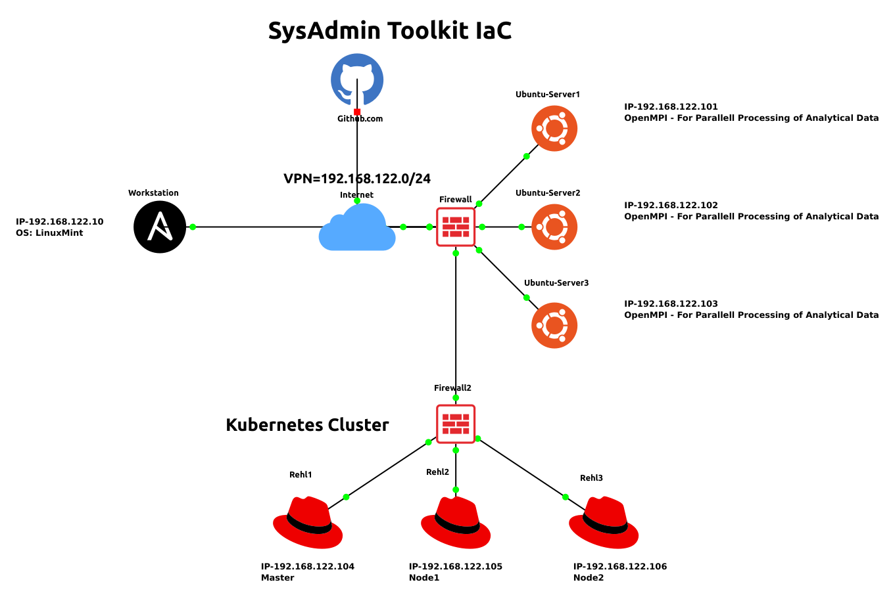

# Workstation

The workstation in your setup plays a crucial role in managing and orchestrating the infrastructure automation using Ansible. Here's a description of the role of the workstation:

Workstation Role Description:

The workstation serves as the central control point for orchestrating infrastructure automation tasks across your three Ubuntu servers (ubuntu-server1, ubuntu-server2, and ubuntu-server3) using Ansible. It acts as the command and control center, allowing you to define, execute, and manage tasks related to server provisioning, software installation, and system configuration.

## Key Responsibilities:

### Ansible Configuration Management:

The workstation is configured with Ansible, a powerful and agentless automation tool.
It holds the Ansible playbook, a set of instructions that define tasks and configurations to be applied to the target servers.
### Playbook Execution:

Using the Ansible playbook, the workstation orchestrates tasks on the target servers concurrently.
Tasks can include server provisioning, software installation, and system configuration based on your specific needs.
### Version Control Integration:

The workstation integrates with the GitHub repository containing your SysAdmin Toolkit for Infrastructure as Code (IaC).
It pulls the latest changes from the repository, ensuring that your infrastructure automation scripts and configurations are up-to-date.
### Customization and Adaptation:

Sysadmins and DevOps professionals use the workstation to customize and adapt the toolkit to suit the unique requirements of the infrastructure.
### Workflow Optimization:

The workstation streamlines and optimizes the infrastructure management workflow, reducing manual interventions and ensuring consistency across servers.
### Collaboration and Monitoring:

It facilitates collaboration by allowing multiple team members to contribute to the Ansible playbook and other automation scripts.
The workstation provides a central point for monitoring and managing the execution of automation tasks, ensuring visibility into the infrastructure's state.
In summary, the workstation is the command center where Ansible, in conjunction with your SysAdmin Toolkit, is used to automate, manage, and maintain the infrastructure across your three Ubuntu servers. It empowers you to efficiently provision servers, install software, and configure systems in a consistent and reproducible manner.
